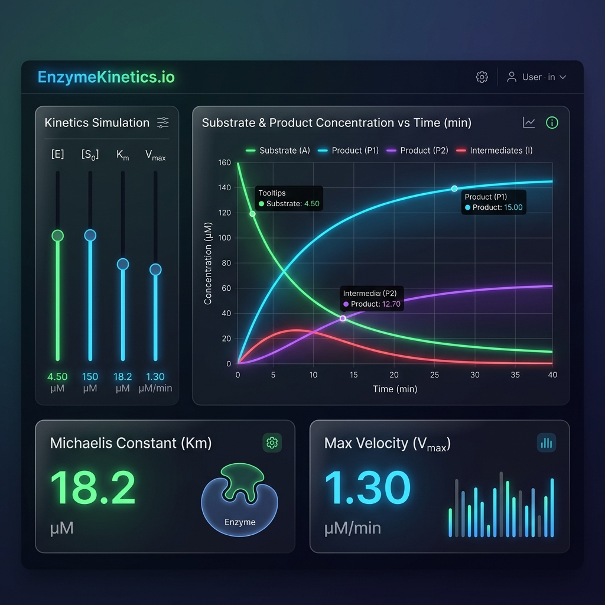

# 🧪 EnzymeKinetics.io — High-Performance ODE Simulation Engine

> **A browser-based scientific computing application that numerically solves and visualizes enzyme-substrate reaction kinetics in real-time.**

[](https://fastapi.tiangolo.com)
[](https://react.dev)
[](https://scipy.org)
[](https://vitejs.dev)
[](https://docker.com)

---

## 📸 Dashboard Preview



*A responsive, modern, dark-themed scientific interface with real-time parameter tuning, numerical solvers, and glowing data visualization of biochemical concentrations over time.*

---

## 🔬 Core Science & Mathematics

`EnzymeKinetics.io` simulates the classical **Michaelis-Menten** reaction mechanism where an enzyme ($E$) binds reversibly to a substrate ($S$) to form an enzyme-substrate complex ($ES$), which then converts irreversibly into a product ($P$) and regenerates the free enzyme:

$$E + S \underset{k_{-1}}{\overset{k_1}{\rightleftharpoons}} ES \xrightarrow{k_2} E + P$$

### System of Ordinary Differential Equations (ODEs)
Rather than relying on steady-state approximations, this simulation solves the complete, time-dependent non-linear ODE system using Python’s high-performance **SciPy** suite (`scipy.integrate.odeint`):

$$\frac{d[E]}{dt} = -k_1[E][S] + (k_{-1} + k_2)[ES]$$

$$\frac{d[S]}{dt} = -k_1[E][S] + k_{-1}[ES]$$

$$\frac{d[ES]}{dt} = k_1[E][S] - (k_{-1} + k_2)[ES]$$

$$\frac{d[P]}{dt} = k_2[ES]$$

### Kinetic Constants Calculated
* **Michaelis Constant ($K_m$):** Reflects the affinity of the enzyme for its substrate.
  $$K_m = \frac{k_{-1} + k_2}{k_1}$$
* **Maximum Velocity ($V_{max}$):** The maximum rate of reaction at saturating substrate levels.
  $$V_{max} = k_2 [E]_0$$

---

## ⚡ Key Features

* **Interactive Parameter Tuning:** Adjust rate constants ($k_1, k_{-1}, k_2$) and initial concentrations ($[E]_0, [S]_0$) using reactive sliders with immediate simulation updates.
* **Precise Numerical Solvers:** Utilizes `SciPy` for smooth, high-fidelity integration of non-linear differential equations.
* **Modern glassmorphism UI:** Stunning dark-mode dashboard built with React 19, custom CSS variables, and Lucide React icons.
* **Vibrant Data Visualization:** Clean, animated multi-series line charts courtesy of Recharts.
* **Containerized Deployment:** Includes an optimized Docker container and Render blueprint for seamless one-click cloud deployments.

---

## 📂 Project Structure

```bash
├── api.py                 # FastAPI backend containing SciPy ODE solvers
├── src/                   # React frontend codebase
│   ├── App.jsx            # Core UI layout & state management
│   ├── index.css          # Premium glassmorphic styling system
│   └── main.jsx           # Vite application entry point
├── package.json           # Frontend Node dependencies
├── requirements.txt       # Backend Python dependencies
├── Dockerfile             # Production multi-stage build manifest
├── render.yaml            # Render hosting service configuration
└── screenshot.png         # Main application visual showcase
```

---

## 🚀 Local Setup & Installation

### Prerequisites
* Python 3.10+
* Node.js 18+

### 1. Clone the Repository
```bash
git clone https://github.com/shahidafridilaskar9-hash/enzyme-kinetics-web.git
cd enzyme-kinetics-web
```

### 2. Backend Setup (FastAPI)
Create a Python virtual environment and install the mathematical dependencies:
```bash
# Create and activate virtual environment
python -m venv venv
venv\Scripts\activate      # On Windows
source venv/bin/activate   # On Mac/Linux

# Install required packages
pip install -r requirements.txt
```

### 3. Frontend Setup (React + Vite)
Open a new terminal window to install Node modules and bundle the assets:
```bash
npm install
npm run build
```

### 4. Run the Combined Server
With the frontend built into `dist/`, launch the FastAPI server which will host the backend and serve the static frontend:
```bash
python -m uvicorn api:app --reload --port 8000
```
Visit `http://localhost:8000` in your web browser to interact with the simulation.

---

## 🐳 Docker Deployment

The application is pre-packaged with a multi-stage Docker build that builds the frontend and bundles it directly with the FastAPI server for high-efficiency production:

```bash
# Build the image
docker build -t enzyme-kinetics-web .

# Run the container
docker run -p 8000:8000 enzyme-kinetics-web
```

---

## 📄 License & Citations

Developed as a scientific computing demonstration for enzyme-substrate dynamics. Open-source under the MIT License.
